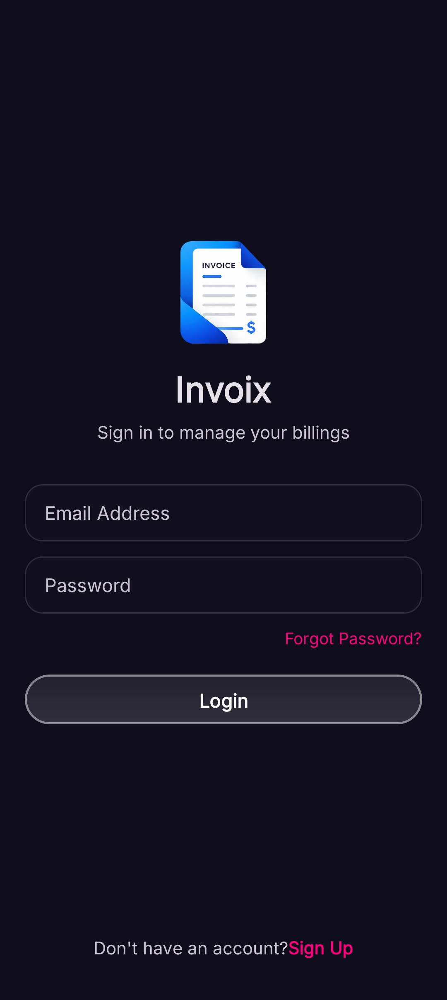
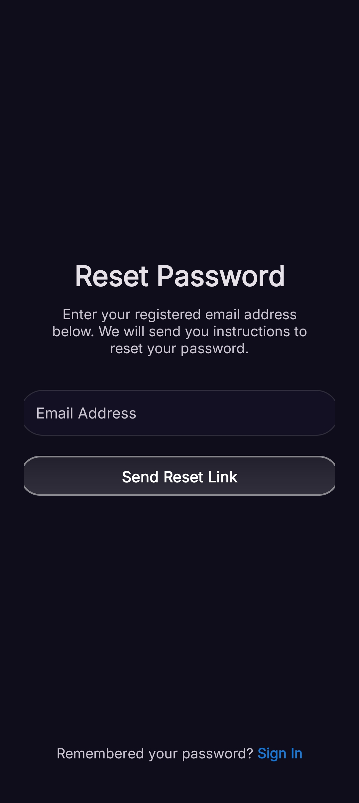
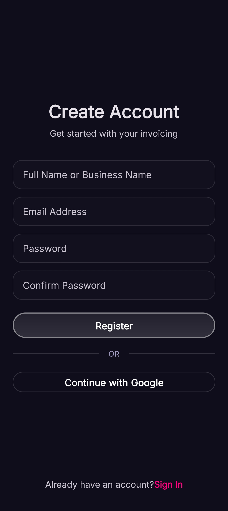
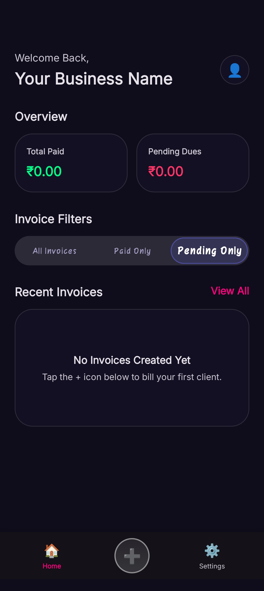
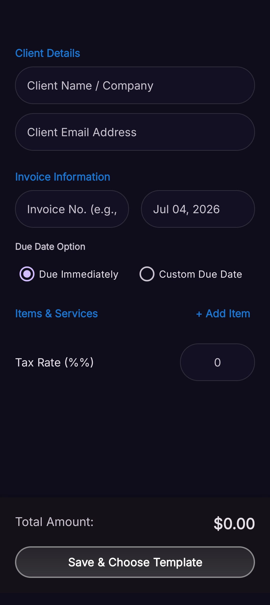
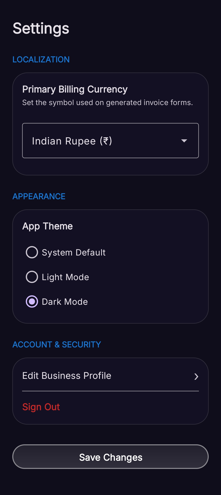
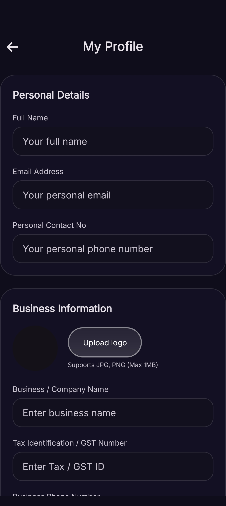

# 🚀 Invoix

> **CREATE. SEND. GET PAID.**

A modern Android invoice management application built for **freelancers, startups, and small businesses**. Invoix helps users create professional invoices, manage clients, track payments, and monitor business performance through a clean and intuitive interface.

---

## 📸 Screenshots

> **Important:** Create a folder named **`Screenshots`** in the root of your repository and place all screenshots inside it.

| Splash | Login |
|--------|-------|
|  |  |

| Register | Forgot Password |
|-----------|-----------------|
|  |  |

| Dashboard | Create Invoice |
|------------|----------------|
|  |  |

| Settings | Business Profile |
|----------|------------------|
|  |  |

---

# ✨ Features

- 📄 Create professional invoices
- 👥 Manage clients
- 💰 Track paid & pending invoices
- 📊 Dashboard with business analytics
- 🧾 Multiple invoice items
- 💸 Tax & discount calculation
- 📅 Due date management
- 🌍 Multi-currency support
- 🏢 Business profile management
- 🔐 Secure Firebase Authentication
- ☁ Firebase Cloud Database
- 🎨 Beautiful Material Design UI
- 🌙 Dark Theme Support

---

# 🛠 Tech Stack

| Technology | Used |
|------------|------|
| Language | Java |
| UI | XML |
| IDE | Android Studio |
| Authentication | Firebase Authentication |
| Database | Firebase Realtime Database / Cloud Firestore |
| Storage | Firebase Storage |
| Version Control | Git & GitHub |

---

# 📂 Project Structure

```
Invoix
│
├── app/
├── Screenshots/
├── README.md
├── gradle/
└── build.gradle
```

---

# 🚀 Installation

### Clone Repository

```bash
git clone https://github.com/tejasdhakate62-dev/Invoix.git
```

### Open Project

```
Android Studio
→ Open Existing Project
→ Select Invoix
```

### Firebase Setup

- Create a Firebase Project
- Enable Authentication
- Enable Email/Password
- Enable Google Sign-In
- Enable Firestore or Realtime Database
- Download `google-services.json`
- Place it inside:

```
app/google-services.json
```

### Run

Connect an Android device or Emulator and click **Run ▶**.

---

# 📋 Requirements

- Android Studio Ladybug or newer
- JDK 17+
- Android SDK 24+
- Google Play Services

---

# 🔥 Future Improvements

- PDF Invoice Export
- Invoice Sharing
- QR Payment
- GST Support
- Offline Mode
- Cloud Backup
- Multiple Businesses
- Expense Tracking
- Reports & Charts
- Push Notifications

---

# 🤝 Contributing

Contributions are welcome.

1. Fork the repository
2. Create a feature branch

```bash
git checkout -b feature-name
```

3. Commit changes

```bash
git commit -m "Added new feature"
```

4. Push

```bash
git push origin feature-name
```

5. Open a Pull Request

---

# 👨‍💻 Author

**Tejas Dhakate**

🎓 Computer Engineering Student  
🏫 Rashtrasant Tukadoji Maharaj Nagpur University (RTMNU)

- GitHub: https://github.com/tejasdhakate62-dev
- Portfolio: https://tejasdhakate62-dev.github.io
- Email: tejasdhakate62@gmail.com

---

# ⭐ Support

If you like this project, consider giving it a ⭐ on GitHub.

---

## 📄 License

This project is licensed under the MIT License.
